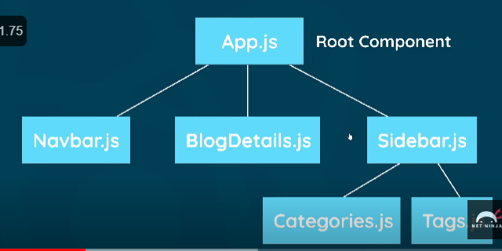

# Notes

## Compenent Tree

Each one is a component

- JSON Objects cannot be output straight away, only numbers, strings

```
  <Navbar /> is same as <Navbar></Navbar>
``` 

# Folder structure of React app
When structuring your React app's folder, there is no one-size-fits-all approach, as it can vary based on the size and complexity of your project. However, here is a commonly used folder structure that can serve as a starting point:

```
src
|-- components
|   |-- Component1
|   |   |-- Component1.js
|   |   |-- Component1.css
|   |   |-- Component1.test.js
|   |-- Component2
|   |   |-- Component2.js
|   |   |-- Component2.css
|   |   |-- Component2.test.js
|-- pages
|   |-- HomePage
|   |   |-- HomePage.js
|   |   |-- HomePage.css
|   |   |-- HomePage.test.js
|   |-- AboutPage
|   |   |-- AboutPage.js
|   |   |-- AboutPage.css
|   |   |-- AboutPage.test.js
|-- utils
|   |-- api.js
|   |-- helper.js
|-- App.js
|-- index.js
|-- index.css
|-- serviceWorker.js
|-- reportWebVitals.js
```

Here's a breakdown of the main folders:

- `components`: This folder contains reusable UI components. Each component can have its own folder with the component file (e.g., `Component1.js`), associated styles (e.g., `Component1.css`), and tests (e.g., `Component1.test.js`).

- `pages`: This folder contains the top-level pages or views of your application. Each page can have its own folder with the page file (e.g., `HomePage.js`), associated styles (e.g., `HomePage.css`), and tests (e.g., `HomePage.test.js`).

- `utils`: This folder contains utility functions, helper classes, or API-related files that can be used across different parts of your application.

- `App.js` and `index.js`: These files are the entry points of your application. `App.js` typically serves as the main component where you define the overall layout and routing, while `index.js` is responsible for rendering the `App` component and mounting it to the DOM.

- `index.css`: This file contains global styles that apply to the entire application.

- `serviceWorker.js` and `reportWebVitals.js`: These files are related to service workers and web vitals reporting, respectively, and are optional based on your project requirements.

Remember that this is just a suggested folder structure, and you can modify or expand it based on your specific needs. It's essential to keep your folder structure organized and maintain consistency throughout your project to improve code readability and maintainability.